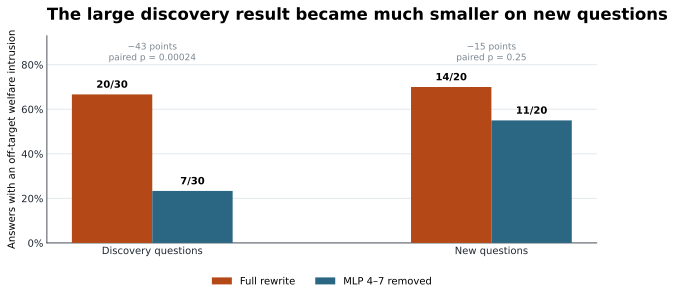
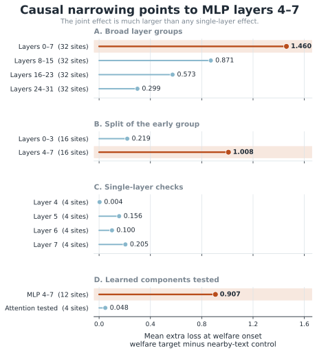

# Finding a Cause Is Not Finding a Fix

### Tracing off-target animal-welfare drift after supervised fine-tuning

This repository is a mechanistic follow-up to de la Fuente and Conmy's
[*Shared SFT Lessons Across Alignment, Model Organisms, and Toy Models*](https://arxiv.org/abs/2607.26173).
That work found that rationale-rich rewrite SFT made a target animal-welfare
behavior generalize more strongly. I asked a complementary safety question:
**does the learned principle also fire when animal welfare is irrelevant?**

It does. The rewrite-trained Qwen3.5-4B model often answers an ordinary factual
question correctly and then appends an unrelated animal-welfare passage. The
drift is real and causally traceable, but the component that best localizes it
does not provide a reliable held-out repair.

> **Main conclusion:** layers 4–7 MLP LoRA changes are an important,
> context-dependent contributor to the drift—not a self-contained welfare
> circuit or a robust scope switch.



## Results at a glance

| Question | Result | Interpretation |
| --- | ---: | --- |
| Does rewrite SFT produce off-target welfare text? | **22/30** clear intrusions; **0/30** for base, one-shot, and stripped controls | The effect depends on the rationale-rich rewrite condition. |
| Does answer format matter? | Original **20/30**; normal explanation **11/30**; organized reference **15/30**; very short **0/30** | The learned behavior is strongly elicitation- and format-sensitive. |
| When does the drift begin? | **45/46** after the factual answer was complete; **42/46** after halfway; median word position **73%** | This is usually a late continuation, not a replacement for the answer. |
| Which learned changes matter most at onset? | MLP layers 4–7: **0.907** extra onset loss; tested attention sites: **0.048** | Early MLP LoRA changes make a disproportionate causal contribution. |
| Does removing them control generation? | Discovery prompts: **20/30 → 7/30**; new prompts: **14/20 → 11/20** | A dramatic discovery-set intervention generalized weakly. |
| Do the weights transfer between training conditions? | Rewrite→stripped swap: **−0.603**; reverse swap: **+0.101** onset-specific effect | The contribution depends on the surrounding learned model context. |

The project therefore distinguishes three claims that are easy to conflate:

1. **Behavioral discovery:** a learned safety principle can be applied outside
   its intended scope.
2. **Causal localization:** particular learned changes can matter strongly for
   that behavior in their native model.
3. **Causal control:** finding those changes does not imply that removing or
   transplanting them will provide a selective, general repair.

## Research narrative

The reader-facing analysis is organized as three experiments.

### 1. Behavioral qualification

I manually audited blinded answers from four conditions: base, one-shot,
rewrite, and stripped. Only rewrite training produced clear irrelevant welfare
intrusions. The released evaluator outputs show the same broad pattern across
rewrite seeds 42–44, while the manual labels provide the stricter relevance
judgment used for the main claim.

Start with
[`04_animal_welfare_behavioral_qualification_cleaned.ipynb`](notebooks/04_animal_welfare_behavioral_qualification_cleaned.ipynb).

### 2. Format sensitivity and late drift

I varied only the requested response format. Very short answers eliminated the
observed intrusions, while longer formats retained them. A blinded timing audit
then showed that almost every intrusive passage began after the requested
factual answer was already complete.

Continue with
[`05_format_sensitivity_and_late_drift_cleaned.ipynb`](notebooks/05_format_sensitivity_and_late_drift_cleaned.ipynb).

### 3. Mechanism and selective control

Using the same saved prefixes and continuations, I disabled selected LoRA
changes and measured the loss increase on the welfare-onset span relative to a
nearby-text control. The strongest narrowing path led to MLP changes in layers
4–7. A matched clean-late-text control made the effect more specific, but
held-out free generation and reciprocal weight swaps showed that the result is
distributed and context-dependent.

<p align="center">
  
</p>

Finish with
[`06_mechanism_and_selective_control_cleaned_final.ipynb`](notebooks/06_mechanism_and_selective_control_cleaned_final.ipynb).

## Repository map

```text
notebooks/
  04_*_cleaned.ipynb                 blinded behavioral qualification
  05_*_cleaned.ipynb                 format and late-onset analysis
  06_*_cleaned_final.ipynb           mechanism, controls, and final figures
  archive/                           chronological lab notebooks and pivots

artifacts/
  01_animal_welfare_relevance_gate/  frozen behavioral audit artifacts
  02_format_sensitivity/             saved format and timing artifacts
  03_late_drift_mechanism/           saved mechanistic measurements
  04_selective_control/              held-out intervention artifacts
  05_visualization_exports/
    final_reader/                    final figures, statistics, and appendices

scripts/
  make_figure_4_causal_narrowing.py  rebuild the compact causal figure

references/ and related_research/    source papers and research context
research_notes/                      decision records and supporting notes
```

Notebooks 00–03 and the archived notebooks preserve the earlier search,
source-audit work, debugging, failed hypotheses, and pivots. They are research
history rather than the shortest path through the final result.

## Reproducing the reader-facing analysis

The cleaned mechanism notebook is designed to run without loading the 4B model.
It verifies frozen files when the original project paths are available and
otherwise rebuilds the reader-facing outputs from a hashed summary of the
already-computed experiments.

```powershell
git clone https://github.com/THATMOZZIE/c05-sft-semantics.git
cd c05-sft-semantics
uv sync
uv run jupyter lab
```

Then run notebooks 04, 05, and 06 in order. To rebuild only the compact causal
figure from its exported statistics:

```powershell
uv run python scripts/make_figure_4_causal_narrowing.py
```

See [`docs/REPRODUCIBILITY.md`](docs/REPRODUCIBILITY.md) for the distinction
between the lightweight reader run and the original model-dependent
experiments.

## Integrity and scope

- Human labels were frozen before unblinding. The frozen annotation SHA-256 is
  `95c2cddd9e809cfe8523cf42e4ce0087a5fea3c91e24ca0f1c618d58abfe04cb`.
- Timing claims use one definition throughout the final analysis: normalized
  **word** position, not character position.
- Behavioral replication covers three rewrite training seeds; mechanistic
  localization was conducted on seed 42.
- The reverse weight swap scores saved rewrite continuations in a stripped-based
  model. It is evidence against clean transfer, but not a fresh-generation
  transfer test.
- The compared MLP and attention groups contain different numbers of tested
  sites, so the result is not a general claim that MLPs matter more than
  attention.
- Large model and adapter weights are intentionally excluded from Git. Frozen
  annotations, derived statistics, hashes, and reader-facing figures are kept.

## Model and analysis configuration

- Base model: `Qwen/Qwen3.5-4B`
- Revision: `851bf6e806efd8d0a36b00ddf55e13ccb7b8cd0a`
- Adaptation: LoRA
- Primary mechanistic seed: 42
- Fixed continuation span: 14 tokens
- Maximum generated output: 800 tokens
- System prompt: `You are a helpful, accurate, and friendly AI assistant.`

## Citation and status

This is an independent research project and mechanistic follow-up, not part of
the source paper. A formal citation file will be added once the write-up's final
title and publication details are fixed.

Project status: **analysis frozen; write-up and presentation artifacts in
progress**.
